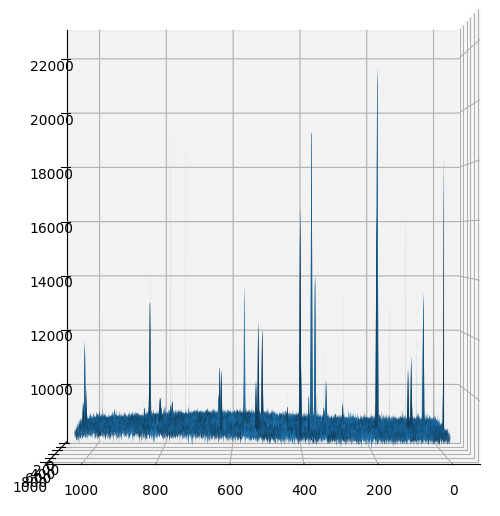
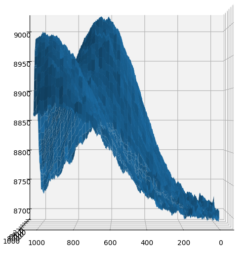
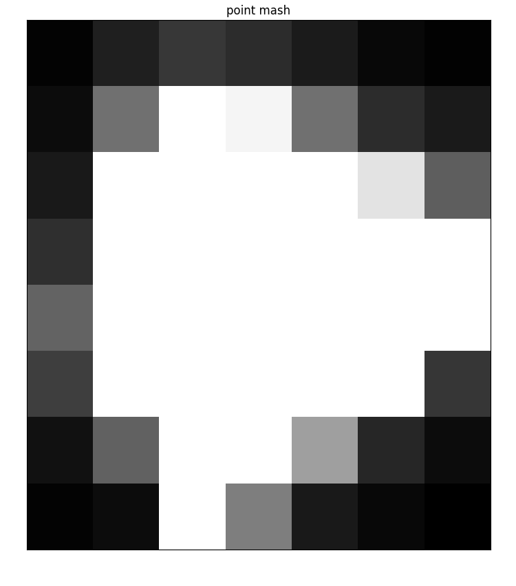
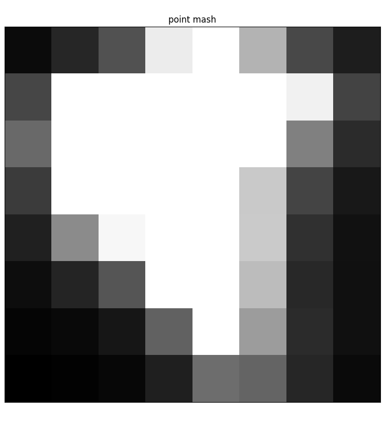
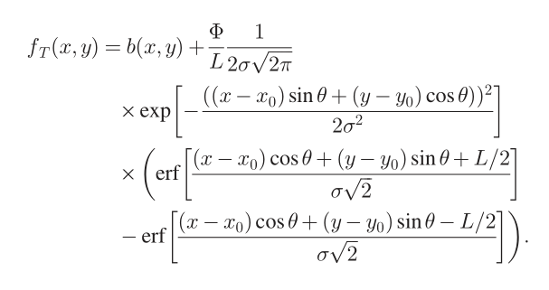
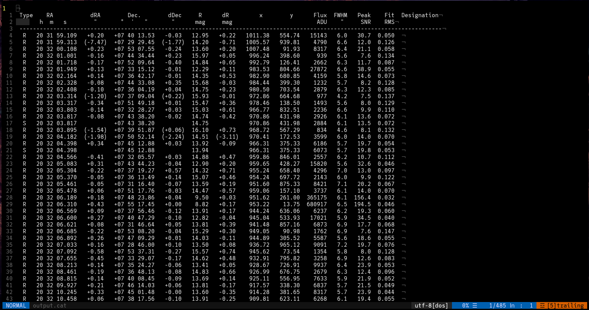

---
title:
- Progress presentation
subtitle:
- Algorithm development for the segmentation of astronomical images with unique features
author:
- Viktor Nagy
theme:
- Warsaw
---

# Space Debris

{#id .class width=100% }

# Space View

{#id .class width=100% }

# GEO/LEO

## There are multiple orbital layers
+ LEO (Low Earth Orbit)
+ GEO (Geosynchronous Earth Orbit)
+ GNSS, GTO, Molniya

##
{#id .class height=35% }

# Change over time

{#id .class width=100% }

# AGO 70cm

## AGO 70 programs
+ Astrometry, surveys
+ Photometry, light curves
+ Photometry, colors

##
{#id .class height=35% }

# Pipeline

{#id .class height=100% }

# Tracking

## There are 2 types of tracking
+ Sidereal tracking
+ Object tracking

##
{#id .class height=35% }

# Steps

+ Image capture
+ Image reduction
+ Sky background estimation/extraction
+ Objects search and centroiding
+ Star field identification
+ Astrometric reduction
+ Star Masking
+ Tracklet building
+ Object identification
+ Data format transformation
+ Output data redistribution

# Sky background estimation/subtraction

## Reasons/Causes
+ Moon light (global linear gradient)
+ Stars, Nebulas, Galaxies (local nonlinear gradients)
+ Hardware related reflexions

## Methods
+ Convolution with large median kernel (at least 25% of the size of image)
+ Sigma clipping

# Sky background estimation/subtraction

{#id .class height=60% }

# Sky background estimation/subtraction

{#id .class height=60% }

# Sky background estimation results

{#id .class height=60% }
{#id .class height=60% }

# Object identification

{#id .class height=100% }

# Object identification

## Methods
+ PSF fitting
+ Edge detection
+ Barycenter positions

# PSF objects detected

{#id .class height=65% }
{#id .class height=65% }

# PSF fitting - trail

{#id .class height=60% }

# PSF fitting

{#id .class height=90% }

# Output

{#id .class height=90% }

# Tools

## Python

+ Numpy
+ Astropy (fits files)
+ Scipy (convolve, fitting)
+ Matplotlib
+ OpenCV
+ Plotly
+ AstroImageJ

# Sources

+ Heiner Klinkrad - Space Debris, Models and Risk Analysis
+ Vladimir Kouprianov et. al. - Distinguishing features of CCD astrometry of faint GEO objects
+ J. Šilha et. al. - Slovakian Optical Sensor for HAMR Objects Cataloguing and Research
+ Jenni Virtanen et. al. - Streak detection and analysis pipeline for space-debris optical images
+ Peter Vereš et. al. - Improved Asteroid Astrometry and Photometry with Trail Fitting
+ Oddelenie astronómie a Astrofyziky - Fakulta matematiky fyziky a informatiky, UK
+ Edith Stöveken et. al. - Algorithms for the Optical Detection of Space Debris Objects

# The End

{#id .class width=100% }
