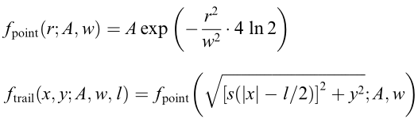

---
title:
- Progress presentation
subtitle:
- Algorithm development for the segmentation of astronomical images with unique features
author:
- Viktor Nagy
theme:
- Copenhagen
---

# Space Debris

{#id .class width=100% }

# Space View

{#id .class width=100% }

# GEO/LEO

## There are multiple orbital layers
+ LEO (Low Earth Orbit)
+ GEO (Geosynchronous Earth Orbit)
+ GNSS, GTO, Molniya

##
{#id .class height=35% }

# Change over time

{#id .class width=100% }

# AGO 70cm

## AGO 70 programs
+ Astrometry, surveys
+ Photometry, light curves
+ Photometry, colors

##
{#id .class height=35% }

# Pipeline

{#id .class height=100% }

# Tracking

## There are 2 types of tracking
+ Sidereal tracking
+ Object tracking

##
{#id .class height=35% }

# Steps

+ Image capture
+ Image reduction 
+ Sky background estimation
+ Sky background extraction
+ Star object identification and extraction (image segmentation)
+ Astrometric reduction
+ Star masking
+ Object identification, Image segmentation
+ Tracklet building
+ Tracklet conversion, tracklet the final product

# Sky background estimation/subtraction

## Methods
+ Convolution with large median kernel (at least 25% of the size of image)
+ Sigma clipping

# Sky background estimation/subtraction

{#id .class height=60% }

# Sky background estimation/subtraction

{#id .class height=60% }

# Object identification

{#id .class height=100% }

# Object identification

## Methods
+ Barycenter positions
+ PSF fitting
+ Edge detection

# PSF fitting - trail

{#id .class height=60% }

# PSF fitting

{#id .class height=90% }

# Tools

## Python

+ Numpy
+ Astropy (fits files)
+ Scipy (convolve, fitting)
+ Matplotlib
+ Plotly

# Credits

+ V. Kouprianov, Distinguishing features of CCD astrometry of faint GEO objects\
Advances in Space Research, Volume 41, Issue 7, 2008, \
Pages 1029-1038, ISSN 0273-1177\
http://www.sciencedirect.com/science/article/pii/S0273117707003699

+ Jiří Šilha, PhD. Division of Astronomy and Astrophysics \
Space Debris Research \
Departmen of Astronomy, Physics of Earth and Meteorology, FMPI/CU

# The End

{#id .class width=100% }
